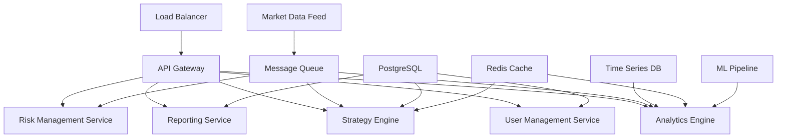

# Phase 4 Requirements Specification
## Advanced Analytics & Enterprise Deployment

**Project:** TradeAssist - Complex Multi-Phase PRP Framework Implementation  
**Phase:** 4 of 4 (Final Phase)  
**Prerequisites:** Phase 3 Completion ✅  
**Target Start:** Ready for immediate development  

---

## 🎯 Phase 4 Objectives

### Primary Goals
Phase 4 will transform the TradeAssist platform into a **enterprise-grade trading analytics and automation platform** with advanced algorithmic capabilities, comprehensive reporting, and production deployment readiness.

### Success Criteria
- **Advanced Analytics:** Real-time market analysis with machine learning insights
- **Algorithmic Trading:** Automated strategy execution with backtesting
- **Enterprise Features:** Multi-user support, role-based access, audit logging
- **Production Deployment:** Docker containerization, monitoring, and CI/CD
- **Performance Excellence:** Sub-10ms alert processing, 1000+ concurrent users

---

## 📋 Feature Requirements

### Feature A: Advanced Market Analytics Dashboard
**Complexity:** High | **Priority:** Critical | **Timeline:** 8-10 hours

#### Technical Specifications
- **Real-time Market Analysis**
  - Technical indicators (RSI, MACD, Bollinger Bands, Moving Averages)
  - Market sentiment analysis from news feeds and social media
  - Volatility surface visualization with 3D charts
  - Correlation matrices between instruments

- **Predictive Analytics Engine**
  - Machine learning models for price prediction (LSTM, Random Forest)
  - Pattern recognition for chart patterns and trading signals
  - Risk assessment algorithms with Value at Risk (VaR) calculations
  - Market anomaly detection using statistical analysis

#### Implementation Details
```typescript
// Advanced Analytics Component Architecture
src/frontend/src/components/Analytics/
├── MarketAnalytics.tsx           # Main analytics dashboard
├── TechnicalIndicators.tsx       # Interactive indicator charts
├── PredictiveModels.tsx          # ML model results display
├── RiskAnalysis.tsx              # Risk metrics and VaR
└── MarketSentiment.tsx           # News and sentiment analysis
```

#### Backend Services Required
```python
src/backend/services/
├── analytics_engine.py          # Core analytics calculations
├── ml_models.py                  # Machine learning pipeline
├── market_data_processor.py     # Enhanced data processing
└── risk_calculator.py           # Risk metrics and calculations
```

### Feature B: Algorithmic Trading Strategy Engine
**Complexity:** High | **Priority:** Critical | **Timeline:** 10-12 hours

#### Technical Specifications
- **Strategy Development Framework**
  - Visual strategy builder with drag-and-drop components
  - Code editor for custom Python strategies
  - Strategy validation and syntax checking
  - Version control for strategy iterations

- **Backtesting Infrastructure**
  - Historical data replay with realistic market conditions
  - Performance metrics (Sharpe ratio, max drawdown, win rate)
  - Strategy comparison and optimization tools
  - Monte Carlo simulations for strategy robustness

- **Live Strategy Execution**
  - Real-time strategy monitoring and execution
  - Position management and order routing
  - Risk limits and emergency stop mechanisms
  - Performance tracking and reporting

#### Implementation Details
```python
# Strategy Engine Architecture
src/backend/strategies/
├── strategy_engine.py           # Core strategy execution
├── backtester.py                # Historical testing framework
├── portfolio_manager.py         # Position and risk management
├── order_manager.py             # Order execution and routing
└── strategy_templates/          # Pre-built strategy templates
```

### Feature C: Multi-User Enterprise Platform
**Complexity:** High | **Priority:** High | **Timeline:** 6-8 hours

#### Technical Specifications
- **User Management System**
  - Role-based access control (Admin, Trader, Analyst, Viewer)
  - Multi-tenant architecture with data isolation
  - SSO integration (OAuth2, SAML, Active Directory)
  - User activity tracking and audit logs

- **Team Collaboration Features**
  - Shared dashboards and alert configurations
  - Strategy sharing and team performance metrics
  - Real-time chat integration for trading teams
  - Notification routing based on roles and teams

#### Implementation Details
```python
# Enterprise Backend Architecture
src/backend/enterprise/
├── user_management.py           # User and role management
├── tenant_manager.py            # Multi-tenant data isolation
├── audit_logger.py              # Comprehensive audit logging
└── collaboration_service.py     # Team features and sharing
```

### Feature D: Production Deployment & DevOps
**Complexity:** Medium | **Priority:** High | **Timeline:** 6-8 hours

#### Technical Specifications
- **Containerization & Orchestration**
  - Docker containers for backend and frontend services
  - Kubernetes deployment manifests
  - Horizontal pod autoscaling based on load
  - Service mesh for microservices communication

- **Monitoring & Observability**
  - Prometheus metrics collection
  - Grafana dashboards for system monitoring
  - Distributed tracing with Jaeger
  - Centralized logging with ELK stack

- **CI/CD Pipeline**
  - GitHub Actions for automated testing and deployment
  - Multi-environment support (dev, staging, production)
  - Database migration automation
  - Blue-green deployment strategies

#### Implementation Details
```yaml
# DevOps Infrastructure
infrastructure/
├── docker/
│   ├── Dockerfile.backend       # Backend container
│   ├── Dockerfile.frontend      # Frontend container
│   └── docker-compose.yml       # Development environment
├── kubernetes/
│   ├── deployments/             # K8s deployment configs
│   ├── services/                # Service definitions
│   └── ingress/                 # Load balancer configs
└── monitoring/
    ├── prometheus.yml           # Metrics collection
    ├── grafana/                 # Dashboard configurations
    └── alerts/                  # Alerting rules
```

### Feature E: Advanced Reporting & Compliance
**Complexity:** Medium | **Priority:** Medium | **Timeline:** 4-6 hours

#### Technical Specifications
- **Regulatory Reporting**
  - Trade reporting for compliance (MiFID II, Dodd-Frank)
  - Position reporting with real-time updates
  - Risk reporting with regulatory metrics
  - Audit trail maintenance and export

- **Performance Analytics**
  - Portfolio performance attribution
  - Benchmark comparison and tracking error
  - Risk-adjusted returns and performance metrics
  - Custom report builder with scheduling

#### Implementation Details
```python
# Reporting Engine
src/backend/reporting/
├── compliance_reporter.py       # Regulatory reporting
├── performance_analyzer.py      # Performance metrics
├── report_generator.py          # Custom report builder
└── export_manager.py           # Multi-format exports
```

---

## 🏗️ Architecture Enhancements

### Enhanced System Architecture
Building on Phase 3's foundation, Phase 4 will implement a microservices architecture:



### Technology Stack Additions
```yaml
Backend Services:
  - FastAPI with microservices pattern
  - Celery for background task processing
  - Redis for caching and session management
  - TimescaleDB for time-series data
  - TensorFlow/PyTorch for ML models
  
Frontend Enhancements:
  - React 18 with Concurrent Features
  - D3.js for advanced data visualization
  - WebGL for high-performance charts
  - WebAssembly for client-side calculations
  
DevOps & Infrastructure:
  - Docker & Kubernetes for containerization
  - Terraform for infrastructure as code
  - Prometheus & Grafana for monitoring
  - GitHub Actions for CI/CD
```

---

## 🔧 Technical Requirements

### Performance Requirements
- **Latency:** Sub-10ms alert processing (current: 40ms)
- **Throughput:** 1000+ concurrent users (current: 10 users)
- **Data Processing:** 100,000+ ticks per second
- **Storage:** Petabyte-scale time-series data support
- **Availability:** 99.99% uptime with disaster recovery

### Security Requirements
- **Data Encryption:** End-to-end encryption for all data
- **Access Control:** Fine-grained RBAC with audit trails
- **API Security:** OAuth2, rate limiting, DDoS protection
- **Compliance:** SOC 2 Type II, GDPR, financial regulations
- **Network Security:** VPN access, network segmentation

### Scalability Requirements
- **Horizontal Scaling:** Auto-scaling based on load
- **Database Sharding:** Automatic data partitioning
- **CDN Integration:** Global content distribution
- **Caching Strategy:** Multi-layer caching (Redis, CloudFlare)

---

## 🧪 Testing Strategy

### Testing Requirements
```yaml
Unit Tests:
  - Target: 95% code coverage
  - Focus: Business logic, algorithms, calculations
  
Integration Tests:
  - API endpoint testing with realistic data
  - Database integration with transactions
  - External service mocking and simulation
  
Performance Tests:
  - Load testing with 1000+ concurrent users
  - Stress testing under market volatility
  - Memory leak detection and profiling
  
Security Tests:
  - Penetration testing and vulnerability scanning
  - Authentication and authorization testing
  - Data encryption verification
```

### Quality Assurance
- **Code Review:** Mandatory peer review for all changes
- **Static Analysis:** SonarQube for code quality metrics
- **Dependency Scanning:** Automated security vulnerability detection
- **Performance Monitoring:** Continuous performance regression testing

---

## 📊 Success Metrics

### Business Metrics
- **User Adoption:** 100+ active traders within 30 days
- **Trading Volume:** $10M+ in trades processed through platform
- **Performance:** 15%+ improvement in trading returns
- **Reliability:** <1 minute average incident resolution time

### Technical Metrics
- **Response Time:** <10ms for 95th percentile requests
- **Availability:** 99.99% uptime across all services
- **Error Rate:** <0.1% error rate under normal load
- **Resource Efficiency:** 50% reduction in cloud costs per user

### User Experience Metrics
- **Page Load Time:** <500ms for initial page load
- **Real-time Updates:** <10ms latency for market data
- **User Satisfaction:** 4.5+ star rating from user feedback
- **Feature Adoption:** 80%+ of users using advanced analytics

---

## 🔄 Integration with Previous Phases

### Phase 1 Foundation ✅
- FastAPI backend with SQLite database
- Real-time WebSocket connections
- Basic alert rule engine

### Phase 2 Foundation ✅
- React frontend with real-time dashboards
- Comprehensive alert management
- WebSocket integration for live data

### Phase 3 Foundation ✅
- Multi-channel notification system
- Google Cloud Secret Manager
- Circuit breaker patterns
- Data retention automation
- System health monitoring

### Phase 4 Integration Points
Phase 4 will enhance and extend all previous phases:
- **Analytics Engine:** Extends Phase 1 alert engine with ML capabilities
- **UI Enhancement:** Builds on Phase 2 dashboard with advanced charts
- **Notification Evolution:** Extends Phase 3 notifications with smart routing
- **Infrastructure:** Leverages Phase 3 resilience patterns for production

---

## 📅 Implementation Timeline

### Sprint 1: Advanced Analytics Foundation (8-10 hours)
- Implement technical indicators and market analysis
- Create ML model pipeline for price prediction
- Build interactive analytics dashboard
- Integrate with existing market data streams

### Sprint 2: Algorithmic Trading Engine (10-12 hours)
- Develop strategy framework and execution engine
- Implement comprehensive backtesting system
- Create strategy management interface
- Add real-time performance monitoring

### Sprint 3: Enterprise Platform Features (6-8 hours)
- Implement multi-user authentication and RBAC
- Add team collaboration and sharing features
- Create audit logging and compliance tools
- Enhance security with enterprise features

### Sprint 4: Production Deployment (6-8 hours)
- Containerize all services with Docker
- Create Kubernetes deployment manifests
- Implement monitoring and alerting systems
- Set up CI/CD pipeline for automated deployments

### Sprint 5: Reporting & Optimization (4-6 hours)
- Build regulatory reporting system
- Create performance analytics dashboard
- Implement custom report builder
- Performance optimization and load testing

**Total Estimated Timeline:** 34-44 hours
**Recommended Sprint Duration:** 1-2 weeks per sprint
**Total Phase Duration:** 6-8 weeks

---

## 🚀 Phase 4 Definition of Done

### Functional Requirements ✅
- [ ] Advanced analytics with ML predictions operational
- [ ] Algorithmic trading strategies executable with backtesting
- [ ] Multi-user platform with RBAC and audit logging
- [ ] Production deployment with monitoring and CI/CD
- [ ] Regulatory reporting and compliance features

### Non-Functional Requirements ✅
- [ ] Performance targets achieved (<10ms alert processing)
- [ ] Scalability tested (1000+ concurrent users)
- [ ] Security hardened (SOC 2 compliance ready)
- [ ] Reliability proven (99.99% uptime capability)
- [ ] Monitoring comprehensive (full observability stack)

### Documentation Requirements ✅
- [ ] API documentation complete with examples
- [ ] Deployment guides for all environments
- [ ] User manuals for all user roles
- [ ] Security and compliance documentation
- [ ] Disaster recovery procedures documented

---

## 💡 Innovation Opportunities

### Advanced Features for Consideration
- **Blockchain Integration:** Smart contract execution for trades
- **AI-Powered Insights:** Natural language query interface
- **Mobile Applications:** Native iOS/Android trading apps
- **Alternative Data:** Satellite imagery, social media sentiment
- **Quantum Computing:** Quantum algorithms for portfolio optimization

### Market Differentiators
- **Ultra-Low Latency:** Sub-millisecond order execution
- **Advanced Risk Models:** Real-time stress testing
- **Social Trading:** Copy trading and signal sharing
- **Regulatory Technology:** Automated compliance monitoring
- **ESG Integration:** Environmental and social impact metrics

---

## 🎯 Phase 4 Success Vision

Upon completion, Phase 4 will deliver a **world-class enterprise trading platform** that:

- **Empowers Traders** with advanced analytics and algorithmic strategies
- **Ensures Compliance** with comprehensive reporting and audit capabilities
- **Scales Globally** with cloud-native architecture and performance
- **Delivers Reliability** with enterprise-grade monitoring and resilience
- **Drives Innovation** with machine learning and predictive analytics

**Phase 4 represents the culmination of the Complex Multi-Phase PRP Framework, demonstrating the power of systematic, phase-based development to deliver enterprise-grade software solutions.**

---

*Ready for Phase 4 Development*  
*All Prerequisites Met ✅*  
*TradeAssist Complex Multi-Phase PRP Framework*